## Ashton Larkin<br>
##### May 31, 2022<br>
##### IT FDN 110 A Spring 2022: Foundations of Programming: Python<br>
##### Assignment07<br>
##### https://github.com/AshtonUniverse/IntroToProg-Python-Mod07<br>
##### https://github.com/AshtonUniverse/IntroToProg-Python-Mod07<br>

###  Introduction:<br>

The objective of assignment 07 is to create a script that demonstrates how pickling and
structured error handling work.  The “Personal Data” (Assignment07.py) program has three separations of concerns: Data, Processing, and Presentation (Input-Output).<br>  

### The script performs the following steps (pseudocode):<br>

Step 1 - When the program starts, load data from PersonalData.dat.<br>
Step 2 - Display a menu of choices to the user.<br>
Step 3 - Show current data.<br>
Step 4 - Add data.<br>
Step 5 - Remove data.<br>
Step 6 - Save Data.<br>
Step 7 – Exit the menu / program.<br>

This document is a breakdown of the logic I used for assignment 07. I will list each step highlighting code I created along with detail on the logic and its purpose.<br>  

### Added a script header:<br>

```
##### ---------------------------------------------------------------------------- #
##### Title: Assignment 07
##### Description:  Create a script that demonstrates how pickling and
#####               structured error handling work.
##### ChangeLog (Who,When,What):
##### ALarkin,5.31.2022,Assignment 07
##### ---------------------------------------------------------------------------- #
```

##### -- Data -- #
##### Declare variables and constants

*The data section contains four global variables used in the script:*

```
datFile = "PersonalData.dat"    # An object that represents a file<br>
dicRow = {}     # A row of data separated into elements of a dictionary<br>
lstTable = []   # A list that acts as a 'table' of rows<br>
strChoice = ""  # Capture the user option selection<br>
```

##### -- Processing -- #

##### Step 1 - When the program starts, load data from PersonalData.dat

*Step 1 loads any existing data from PersonalData.dat into a list table.  It includes a try/except block that contains the variable isfile_bln that performs a validation on the datFile parameter passed to the function “os.path.isfile” and returns a Boolean value (True or False).  This function also calls the os. path module.  It is useful when processing files from different places in the system and for different purposes such as for merging, normalizing, and retrieving path names in python.  If isfile_bln evaluates to “True,” datFile is determined to be a valid file and I then import the pickle module and unpickle the data from the datFile into the objFileData variable which is then unpacked into the list table variable lstTable.  I added two exceptions for the try/except block.  The first “FileNotFoundError” is redundant code since I am already validating the file with os.path.isfile, however, I added this exception to demonstrate an alternative method for catching the error: FileNotFoundError: [Errno 2] No such file or directory.  The last exception is a catch all for general error handling.  For all exceptions in this script, I included print() statements for Pythons built in error information commented out to show the optional choice.<br>*

``` 
try:
    import os.path
    isfile_bln = (os.path.isfile(datFile))
    if (isfile_bln == True):
        import pickle
        # Read data with pickle.load method from datFile
        objFile = open(datFile, "rb")
        objFileData = pickle.load(objFile)>
        objFile.close()
        print()  # adding a new line for looks
        print("****************************")
        print("Unpickle Data Completed") #unpickle
        print("****************************")
        print()
        for row in objFileData:
            print(row["Name"] + ' | ' + row["Address"] + ' | ' + row["Phone"] + ' | ' + row["Email"]
                  + ' | ' + row["DOB"] + ' | ' + row["SSN"])
            lstTable = (objFileData)
except FileNotFoundError as e:
    print("Error File Not Found:", e, sep='\n')
    # print("Built-In Python error info: ")
    # print(e, e.__doc__, type(e), sep='\n')
except Exception as e:
    print()
    print("Error Reading Data From File:", e, sep='\n')
    # print("Built-In Python error info: ")
    # print(e, e.__doc__, type(e), sep='\n')
```

##### -- Input/Output -- #<br>

##### Step 2 - Display a menu of choices to the user.<br>

*Step 2 begins the while loop and displays the menu of options along with the variable strChoice set to an input() function for the user to select option 1-5 to perform.<br>*

```
while (True):
     print("""
     ****************************
     Option Menu: Personal Data
     ****************************
     1) Show current data
     2) Add data
     3) Remove data
     4) Save data 
     5) Exit Program
     ****************************
     """)
     
     strChoice = str(input("Which option would you like to perform? [1 to 5] - "))
     print() # adding a new line for looks
```

##### Step 3 - Show current data.<br>

*Step 3 executes menu option one to show current data.  It uses a try/except block with a for loop to unpack the data from the list table lstTable.  I added a catch all exception to capture all general errors.<br>*

```
if (strChoice.strip() == "1"):
    try:
       print() # adding a new line for looks
       print("****************************")
       print("Current Personal Data")
       print("****************************")
       for row in lstTable:
           print(row["Name"] + ' | ' + row["Address"] + ' | ' + row["Phone"] + ' | ' + row["Email"]
             + ' | ' + row["DOB"] + ' | ' + row["SSN"])
    except Exception as e:
       print() # adding a new line for looks
       print("Error Showing Current Data:", e, sep='\n')
       # print("Built-In Python error info: ")
       # print(e, e.__doc__, type(e), sep='\n')
    continue
```

##### Step 4 - Add data.<br>

*Step 4 executes menu option three to add data. It uses try/except block that contains input() statements for the user to enter personal data including: Name, Address, Phone Number, Email, Date of Birth (DOB), and Social Security Number (SSN).  I used the strip() method to remove whitespace and characters from the beginning and the end of strings, the lower() method to return strings where all characters are lower case, and the title() method to return a string where the first character in every word is upper case.  This ensures consistency in how the data’s stored, presented, and removed in other steps.  I also added if statements with a raise Exception on multiple inputs to validate the users input for data validation including length, isnumeric() and find().  The exception block catches all general errors and the individual raised exceptions for the input() steps.<br>*

```
elif (strChoice.strip() == "2"):
    try:
       print("Enter personal data: ")
       strName = str(input("Name: ").strip().lower().title())
       strAddress = str(input("Address: ").strip().lower().title())
       strPhone = str(input("Phone Number: ").strip().replace(" ", "").replace("-", ""))
       if strPhone.isnumeric() != True or len(strPhone) != 10:
           raise Exception("Phone number contains characters or length not equal to 10: " + strPhone)
       strEmail = str(input("Email: ").strip().lower())
       if strEmail.find("@") == -1 or strEmail.find(".") == -1:
           raise Exception("Email improperly formatted: " + strEmail)
       strDOB = str(input("Date of Birth [yyyymmdd]: ").strip().replace(" ", "").replace("-", ""))
       if strDOB.isnumeric() != True or len(strDOB) != 8:
           raise Exception("DOB contains characters or length not equal to 8: " + strDOB)
       strSSN = str(input("Social Security Number: ").strip().replace(" ", "").replace("-", ""))
       if strSSN.isnumeric() != True or len(strSSN) != 9:
           raise Exception("SSN contains characters or length not equal to 9: " + strSSN)
       dicRow = {"Name": strName, "Address": strAddress, "Phone": strPhone, "Email": strEmail, "DOB": 
                       strDOB, "SSN": strSSN}
       lstTable.append(dicRow)
    except Exception as e:
       print() # adding a new line for looks
       print("Error Adding Data:", e, sep='\n')
       # print("Built-In Python error info: ")
       # print(e, e.__doc__, type(e), sep='\n')
    continue
```

##### Step 5 - Remove data.<br>

*Step 5 executes menu option three to remove data.  I added a try/except block that includes an input() statement that asks the user to input a “name” to remove including the strip(), lower(), and title() methods to ensure data consistency and validation on row lookup.  I also added a Boolean variable “remove_bln” to verify if the data exists in the list table lstTable.  If remove_bln evaluates to “True,” the data is removed from the list table, and it prints the “name” removed from personal details.  If remove_bln evaluates to “False,” the data does not exist, and it prints the “name” is not in personal details.  The exception block catches all general errors.<br>*

```
elif (strChoice.strip() == "3")
     try:
         strRemove = str(input("Enter a name to remove from personal details: ").strip().lower().title())
         remove_bln = False  # verify that the data was found
         for row in lstTable:
             if (row["Name"] == strRemove):
                 lstTable.remove(row)
                 remove_bln = True
         # Update user on the status
         if remove_bln == True:
             print()  # Add an extra line for looks
             print("\n" + strRemove + " removed from personal details. ")
         else:
             print()  # Add an extra line for looks
             print(strRemove + " is not in personal details. ")
     except Exception as e:
        print() # adding a new line for looks
        print("Error Removing Data:", e, sep='\n')
        # print("Built-In Python error info: ")
        # print(e, e.__doc__, type(e), sep='\n')
     continue
```

##### Step 6 - Save Data.<br>

*Step 6 executes menu option four to save data.  I added a try/except block that begins with the strOverwrite variable set to an input() statement asking the user for a “y/n” (yes or no) to overwrite the data file.  If “no” the conditional breaks.  If “yes,” I call the import pickle module, open() function to open the data file and “pickle.dump” to write the lstTable data to the binary file PersonalData.dat.  A print() statement prints “Data Saved” on completion.  The exception block catches all general errors.<br>*

```
elif (strChoice.strip() == "4"):
    try:
        strOverwrite = str(input("Overwrite: " + datFile + "?" + " [y/n] ").strip().lower())
        if (strOverwrite == 'y'):
            import pickle
            objFile = open(datFile, "wb")
            pickle.dump(lstTable, objFile)
            objFile.close()
            print()  # adding a new line for looks
            print("*************")
            print("Data Saved")
            print("*************")
        else:
            break
    except Exception as e:
        print()  # adding a new line for looks
        print("Error Saving Data:", e, sep='\n')
        # print("Built-In Python error info: ")
        # print(e, e.__doc__, type(e), sep='\n')
    continue
```

##### Step 7 – Exit the menu / program.<br> 

*Step 7 exits the loop, and an input() function prompts the user to press the “enter” key to exit the program.<br>*

```
 elif (strChoice.strip() == '5'):
 break

input("\nPress the enter key to exit")
```

### Run the script from PyCharm.<br>

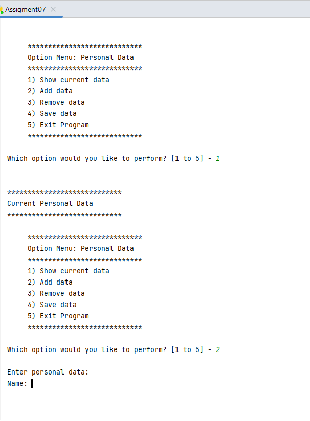
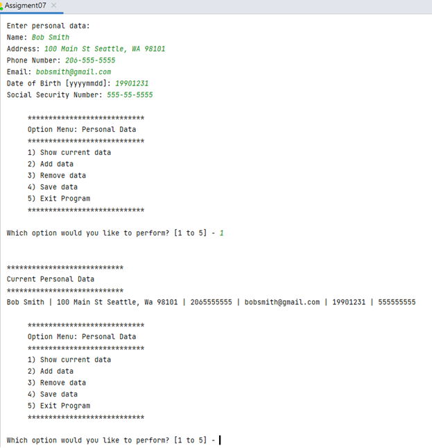
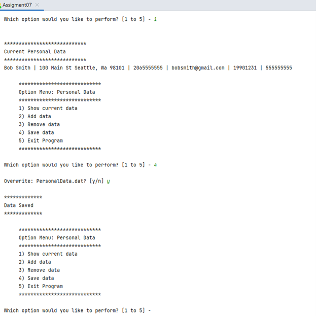
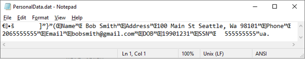
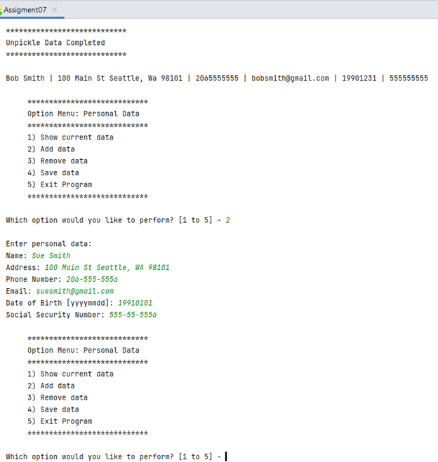
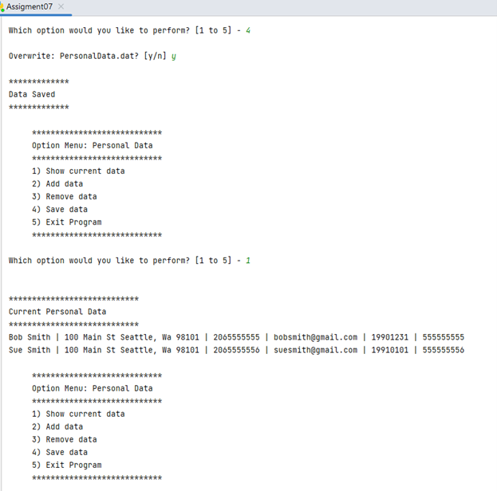
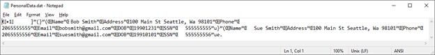
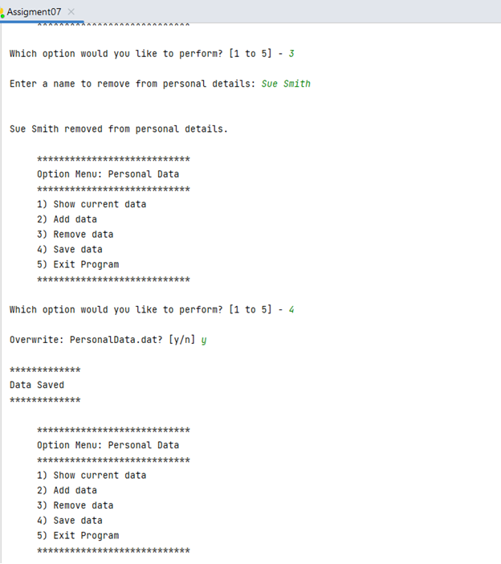
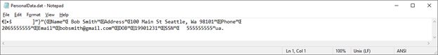
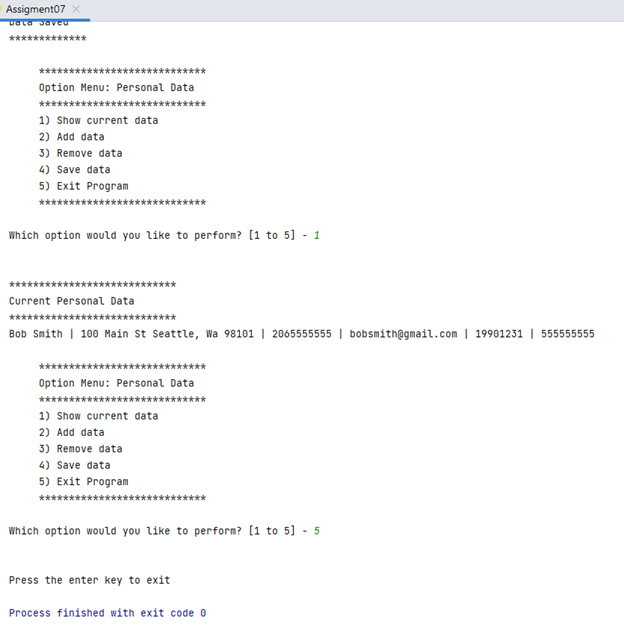

### Run the Python Script from the Windows OS Command Shell and verify the data in the ToDoList.txt file.<br>

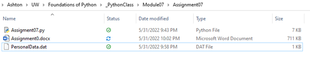
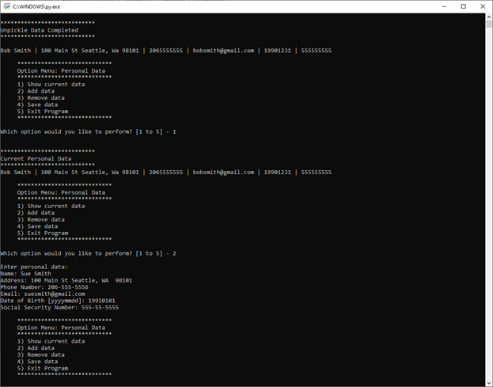

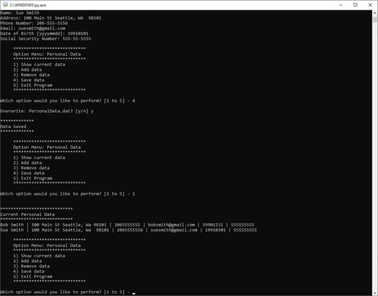
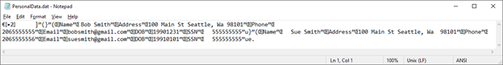
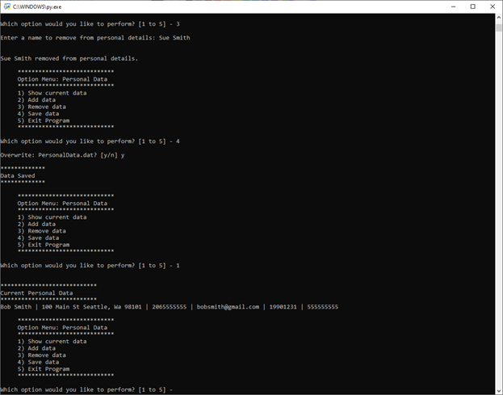
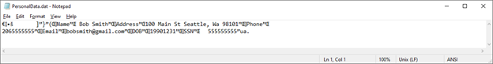
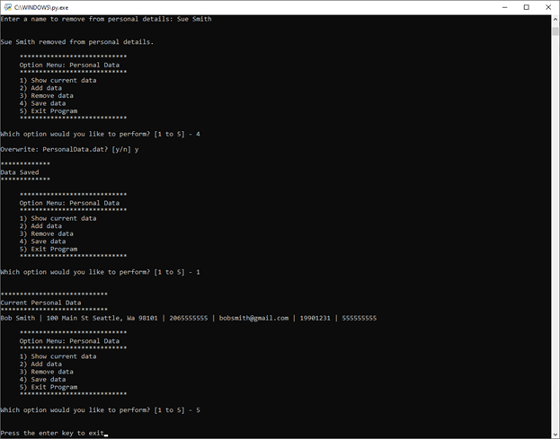

### Summary:<br>

My Assignment07.py script demonstrates the use of pickling data to a binary file and
Pythons Exception class for structured error handling.  This program prompts the user with a menu of options that allow the user to show current data, add data, remove data, save data to a binary file, and exit the program.  Multiple steps in the program contain try/except blocks to raise specific exceptions and/or uses Pythons general error handling for catch all errors.  In addition, I included one step that had multiple exception blocks to illustrate how Python can do layered exceptions.  I used the following research for this module in addition to the class and lecture materials.<br>

Python Programming for the Absolute Beginner Third Edition, Chapter 7.<br>
https://docs.python.org/3/library/pickle.html<br>
https://docs.python.org/3/tutorial/errors.html<br>
